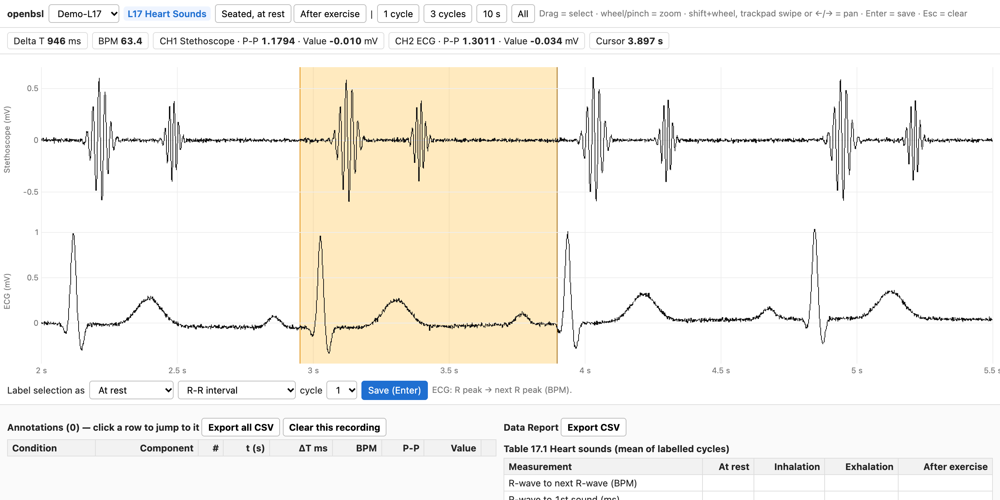

# openbsl

Open [Biopac Student Lab](https://www.biopac.com/product-category/education/biopac-student-lab-bsl/)
recordings without the proprietary software.

Physiology lab courses record ECG, pulse and heart sounds with BSL, then send students home with
files that only BSL can open. openbsl reads those files, exports them to CSV, and packages them
into a static browser page that reproduces what BSL's *Review Saved Data* mode is used for:
drag-select a region, read off Delta T, BPM, P-P and Value, label it, and have the lesson's
Data Report tables fill themselves in.

**[Live demo](https://k8rthik.github.io/openbsl/)**. It runs on synthetic recordings, so nobody's ECG is published.



## Install

```sh
pip install git+https://github.com/k8rthik/openbsl
```

Python 3.10+. Reading files uses [bioread](https://github.com/uwmadison-chm/bioread), the
open-source AcqKnowledge parser.

## Use

```sh
openbsl view Keerthik-L05 Partner-L05     # build a viewer folder and open it in the browser
openbsl export Keerthik-L05               # CSVs: signals, markers, beats, per-segment heart rate
openbsl demo                              # the viewer with synthetic L05 / L07 / L17 recordings
```

`openbsl view` writes a self-contained folder (`openbsl-viewer/` by default: an HTML page, two
scripts and a `data.js`). It opens straight from disk and makes no network requests. Annotations
are kept in the browser's localStorage, and both the annotations and the report tables export to CSV.

### In the viewer

| Action | How |
| --- | --- |
| Select (BSL I-beam) | drag across the trace |
| Zoom / pan | wheel or pinch / shift+wheel, trackpad swipe, ← → |
| Save a measurement | pick condition, component and cycle, press Enter |
| Jump to a saved measurement | click its row |

Conditions are guessed from the nearest segment or event marker (e.g. `Seated, left hand in water`
maps to *Temp. change* in Lesson 7). Each component shows a one-line hint for where the selection
goes, taken from the BSL Analysis Procedure.

## Supported lessons

| Lesson | Channels | Report tables |
| --- | --- | --- |
| L05 ECG I | ECG, Heart Rate (CH40) | 5.2 heart rate, 5.3 systole/diastole, 5.4–5.5 ECG components with normal values |
| L07 ECG & Pulse | ECG, Pulse | 7.1 R-R vs pulse interval, 7.2 QRS and pulse amplitude, pulse wave speed |
| L17 Heart Sounds | Stethoscope, ECG | 17.1 R-to-S1/S2 timing and sound amplitudes, 17.2 change after exercise |

Any other lesson still opens, with one condition per recorded segment and generic Delta T/BPM
selections. Adding a lesson means adding one object to
[`viewer/lessons.js`](src/openbsl/viewer/lessons.js).

## Why measurements are manual

Automatic delineation was tried first: NeuroKit2's DWT and CWT wave boundaries on real student
recordings. On a clean lead the QRS duration was stable to ±2 ms. On a noisy one, P-wave
duration varied ±20–30 ms from beat to beat and T offsets were missing for most post-exercise
beats. Those are the same order as the effects the lab asks you to measure, so the viewer lets
you place the boundaries by eye, as in BSL. R-peak detection *is* automated in `openbsl export`,
where it is reliable: a 5–30 Hz band-pass followed by thresholded peak picking with a 300 ms
refractory period.

## Development

```sh
python -m venv .venv && .venv/bin/pip install -e '.[dev]'
.venv/bin/pytest                         # reader, packing, beat detection vs synthetic ground truth
node --test tests/lessons.test.mjs       # report tables vs hand-computed values
```

The synthetic recordings (`openbsl.synthetic`) are sums of Gaussians per beat (P, Q, R, S, T),
with QT scaled by √RR, respiratory sinus arrhythmia in the deep-breathing segment, and an
exponential post-exercise recovery. Because the true beat times are known, the detector is
tested against ground truth rather than against itself.

Real recordings are git-ignored (`*.acq`, `*-L05`, …). They are someone's health data.

## License

MIT
